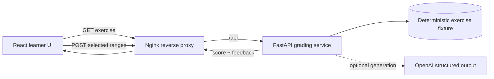

<div align="center">

# Find the Evidence

### Reading & Writing practice built around proof, not guessing.

Select the words that support an answer. Submit them. Get a transparent score.

<p>
  
  
  
  
  
</p>

</div>

> A focused SAT-style evidence-selection prototype. The learner highlights one or more fragments from a shared passage; the system measures coverage, applies a penalty for irrelevant text, and explains the result.

## Why it exists

Most reading practice asks for an answer and hides the reasoning step. **Find the Evidence** makes that step the product:

- highlight evidence directly in the passage;
- work through three questions against the same text;
- receive a coverage-based score with a visible penalty for extra text;
- keep the fixture answer key out of the public exercise response;
- optionally generate a fresh three-question exercise with structured OpenAI output.

## Architecture



| Layer | Responsibility | Location |
| --- | --- | --- |
| Web | Selection capture, highlighting, question flow, feedback UI | `apps/web` |
| API | Public exercise payload, validation, server-side grading | `apps/api` |
| Generation | Strict three-question exercise generation; optional provider seam | `apps/api/app/question_generator.py` |
| Edge | SPA fallback, `/api` proxy, health endpoint | `infra/nginx/nginx.conf` |
| Runtime | Two services with health checks and locked-down containers | `compose.yaml` |

## Quick start: Docker

Requirements: Docker Desktop and a working Compose installation.

```bash
cp .env.example .env
docker compose up --build
```

Open **<http://localhost:8080>**.

Only the web container publishes a host port. The API stays on the internal Compose network and is reached through Nginx at `/api`.

```bash
docker compose logs -f web api
docker compose down
```

Change the host port with `WEB_PORT` in `.env`.

## Local development

Use Node `22.14.x` from `.nvmrc`, npm workspaces, and `uv` for Python dependencies.

```bash
npm ci
npm run web:dev
```

Run the API in a second terminal:

```bash
npm run api:dev
```

The Vite app runs on its normal development port. The API is available at <http://localhost:8000>.

### Optional generated exercises

The browser tries the generated-exercise endpoint first and falls back to the deterministic fixture if generation is unavailable. To enable generation locally, put credentials in `apps/api/.env`:

```dotenv
OPENAI_API_KEY=your-key
OPENAI_MODEL=gpt-4o-mini
```

Do not commit that file. The request contract intentionally accepts only `difficulty`: `easy`, `medium`, or `hard`.

## API surface

| Method | Endpoint | Purpose |
| --- | --- | --- |
| `GET` | `/health` | API health check |
| `GET` | `/api/exercises/rw-evidence-1` | Public fixture without `correct_ranges` |
| `POST` | `/api/exercises/rw-evidence-1/submissions` | Grade selected ranges on the server |
| `POST` | `/api/exercises/generated` | Generate a structured exercise; requires OpenAI configuration |

Example submission:

```json
{
  "question_id": "wastewater-solution",
  "selected_ranges": [
    { "start": 162, "end": 197 },
    { "start": 278, "end": 311 }
  ]
}
```

Ranges are character offsets: `start` is inclusive and `end` is exclusive. Scores are based on correct-character coverage, less a `0.25` penalty for each irrelevant selected character. A score of `70%` or higher passes.

## Verification

```bash
npm run web:test
npm run web:build
npm run api:test
cd apps/api && uv run ruff check .
```

The frontend tests cover generated-exercise fallback, multi-range selection, removal, submission, and review feedback. The API tests cover answer-key redaction, server-side grading, range validation, strict generation input, and provider failure handling.

## Security boundary

The deterministic exercise is served as a public payload without its answer key. The API owns the fixture key and performs the authoritative grading. The generated route is a trusted internal/provider path and returns structured answer ranges so the generated exercise can be used by the client.

Containers are configured with read-only filesystems, dropped Linux capabilities, `no-new-privileges`, non-root users where supported, health checks, and an internal-only API service.

## Project map

```text
.
├── apps/
│   ├── web/                 React + Vite learner experience
│   └── api/                 FastAPI service, fixture, generator, tests
├── infra/nginx/             Reverse proxy and static serving
├── compose.yaml             Docker-first runtime
└── package.json             Workspace scripts
```

## Status

Prototype. The deterministic path is the stable local/demo experience; OpenAI-backed generation is optional and configuration-dependent.
