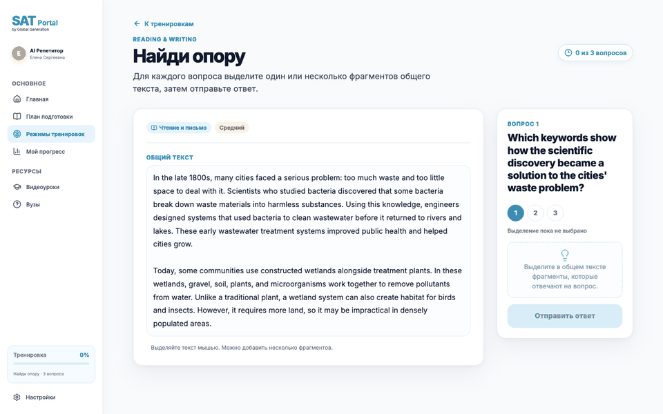

<div align="center">

# Find the Evidence

### Практика Reading & Writing на основе доказательств, а не догадок.

Выделяйте слова, подтверждающие ответ. Отправляйте их. Получайте прозрачную
оценку.

<p>
  
  
  
  
  
</p>

<p>
  <a href="README.md"></a>
  <a href="README.ru.md"></a>
</p>

</div>

<p align="center">
  
</p>

## Стек

- React + Vite — интерфейс ученика
- FastAPI — API проверки ответов
- Nginx — reverse proxy
- Docker Compose — запуск сервисов
- OpenAI — опциональная генерация упражнений

## Что можно протестировать

- **Выбор доказательств:** откройте общий текст Reading & Writing, выделите
  один или несколько фрагментов для вопроса, удалите отдельный фрагмент или
  очистите текущий ответ.
- **Упражнение с несколькими вопросами:** переключайтесь между вопросами;
  выбранные фрагменты и результаты сохраняются отдельно для каждого вопроса.
- **Проверка на сервере:** отправьте ответ и получите результат «пройдено / не
  пройдено», процент, число верно выделенных символов и штраф за лишний текст.
  После отправки показываются верные фрагменты.
- **Управление сессией:** сбросьте упражнение и начните заново. Если настроена
  генерация через OpenAI, кнопка **«Новое упражнение»** запрашивает ещё одно
  упражнение средней сложности.
- **Публичный API:** получайте упражнения без диапазонов ответов и отправляйте
  выделения на проверку; ключ ответов остаётся в API-сервисе.

## Docker

Требуются Docker Desktop и Docker Compose.

```bash
cp .env.example .env
docker compose up --build
```

> [!IMPORTANT]
> **Перед запуском Docker укажите `OPENAI_API_KEY` в `.env`.** Ключ нужен для
> генерации упражнений. Без него приложение использует детерминированный пример.

Откройте <http://localhost:8080>.

Внешний порт публикует web-контейнер. API доступен внутри Compose и проксируется
через Nginx по адресу `/api`.

Полезные команды:

```bash
docker compose logs -f web api
docker compose down
```

Чтобы изменить внешний порт, задайте `WEB_PORT` в `.env`:

```dotenv
WEB_PORT=8080
OPENAI_API_KEY=your-key
OPENAI_MODEL=gpt-4o-mini
```

## Локальная разработка

```bash
npm ci
npm run web:dev
```

Запустите API отдельно:

```bash
npm run api:dev
```

Frontend работает на стандартном порту Vite, API — на
<http://localhost:8000>.

## API

| Метод | Endpoint | Назначение |
| --- | --- | --- |
| `GET` | `/health` | Проверка состояния API |
| `GET` | `/api/exercises/rw-evidence-1` | Упражнение без ключа ответов |
| `POST` | `/api/exercises/rw-evidence-1/submissions` | Проверка ответа на сервере |
| `POST` | `/api/exercises/generated` | Опциональная генерация через OpenAI |

Для генерации принимается только `difficulty`: `easy`, `medium` или `hard`.

## Проверка

```bash
npm run web:test
npm run web:build
npm run api:test
cd apps/api && uv run ruff check .
```

## Структура проекта

```text
apps/web/       React + Vite frontend
apps/api/       FastAPI сервис и тесты
infra/nginx/    Reverse proxy
compose.yaml    Docker runtime
```
